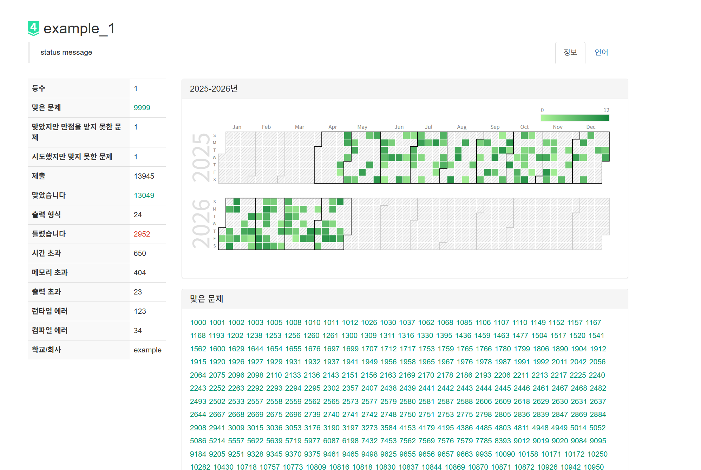

# BOJ-In-My-Heart

곧 서비스가 종료되는
백준 온라인 저지(BOJ) 사이트의 사용자 정보를 추출하여 JSON으로 저장하고 시각화해주는 도구입니다.
로그인을 통한 상세 데이터 추출을 위해 **cli 대신 크롬 확장 프로그램** 사용을 권장합니다.

## 데이터 추출 방법 (크롬 확장 프로그램)

### 1. 확장 프로그램 설치

1. 크롬 브라우저에서 `chrome://extensions/`에 접속합니다.
2. 우측 상단의 **'개발자 모드'**를 활성화합니다.
3. **'압축해제된 확장 프로그램을 로드합니다'** 버튼을 클릭하고, 프로젝트의 `extension` 폴더를 선택합니다.

### 2. 데이터 추출 과정

1. 백준 로그인 후 본인의 **프로필 페이지**(`https://www.acmicpc.net/user/아이디`)로 이동합니다.
2. 확장 프로그램 아이콘을 클릭하고 **'데이터 추출 시작'** 버튼을 누릅니다.
3. **자동 동작**: 확장 프로그램이 프로필 정보를 수집한 후, **언어 통계 페이지로 자동 이동**하여 나머지 데이터를 수집합니다.
4. 모든 수집이 완료되면 알림창과 함께 JSON 파일이 자동으로 다운로드됩니다.

---

## 기존 CLI 도구 사용 (제한적)

## ⚠️ 주의사항

> [!WARNING]
> 이 도구는 백준(BOJ) 및 Solved.ac 라이브 서버에 직접 요청을 보내어 데이터를 수집합니다.
> **서버 부하 및 무분별한 봇(Bot) 동작을 방지하기 위해 CLI 실행 간 3초의 제한 시간(Rate Limit)이 걸려 있습니다.**
> 가급적 본인 아이디로만 실행해 주시기를 권장합니다.

## 실행 방법

이 프로젝트는 **Node.js** 와 **Bun** 환경을 지원합니다.

로그인 없이 접근 가능한 공개 데이터만 추출할 때 사용합니다. (푼 문제 리스트 등 일부 정보가 누락될 수 있습니다.)

### Node.js 환경에서 실행하기

```bash
# 1. cli 폴더로 이동 및 의존성 설치
cd cli
npm install

# 2. 특정 사용자의 데이터 추출 (결과는 data 폴더에 저장됨)
npm start <username>
# 예시: npm start tourist_01
```

### Bun 환경에서 실행하기

```bash
# 1. cli 폴더로 이동 및 의존성 설치
cd cli
bun install

# 2. 특정 사용자의 데이터 추출 (결과는 data 폴더에 저장됨)
bun run cli.ts <username>
# 예시: bun run cli.ts tourist_01
```

### Docker 환경에서 실행하기 (Node.js 24 Alpine)

```powershell
# PowerShell 기준
docker run -it --rm -v "${PWD}:/app" -w /app/cli node:24-alpine sh -c "npm install && npm start <username>"
```

### Docker 환경에서 실행하기 (Bun)

```powershell
# PowerShell, CMD, Mac, Linux 환경 공통
docker run -it --rm -v "${PWD}:/app" -w /app/cli oven/bun:latest sh -c "bun install && bun run cli.ts <username>"
```

## 뷰어 사용 방법 (데이터 시각화)

1. `viewer` 폴더 안의 `viewer.html` 파일을 더블클릭하여 브라우저로 엽니다.
2. 브라우저 화면에서 CLI를 통해 `data` 폴더에 생성된 json 파일을 마우스로 끌어다 놓거나 클릭하여 불러옵니다.
3. 백준 사이트와 99% 유사한 UI로 해당 사용자의 잔디, 맞은 문제, 랭킹 및 언어별 통계 정보를 볼 수 있습니다.



## 데이터 구조 (JSON)

```json
{
  "id": "username",
  "statusMessage": "상태 메시지",
  "leftTable": { "등수": "100", ... },
  "grassData": [ { "date": "2025-01-01", "submit": 5 }, ... ],
  "problemLists": [
    {
      "title": "맞은 문제",
      "problems": ["1000", "1001", "1002"]
    },
    {
      "title": "부분점수를 맞은 문제",
      "problems": ["2557"]
    },
    {
      "title": "시도했지만 맞지 못한 문제",
      "problems": ["1003"]
    }
  ],
  "languageData": [...],
  "solvedAc": {...},
  "timestamp": "2026-04-26T00:00:00.000Z"
}
```

## 라이선스 (License)

이 프로젝트는 **Apache License 2.0**에 따라 배포됩니다.
코드를 자유롭게 사용 및 배포하실 수 있으나, **반드시 저작권(출처) 표기를 포함해야 하며 소스코드를 수정했을 경우 변경 사항을 명시해야 합니다.**
자세한 내용은 `LICENSE` 파일을 참고해 주세요.

---

## 🙏 감사의 글 (Acknowledgments)

**"BOJ는 내 가슴속에 ❤️"**

백준 온라인 저지에서의 알고리즘 풀이는 정말 즐거웠습니다.

저를 포함한 수많은 개발자들의 성장을 도와준 **백준 온라인 저지(BOJ)**와 **Solved.ac** 팀에 깊은 감사를 드립니다.
